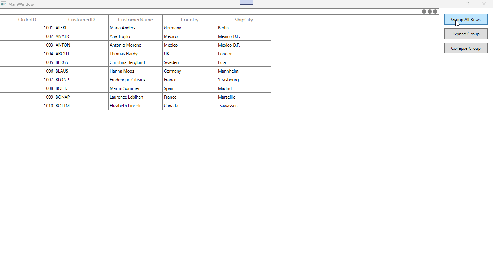

# How-to-Programmatically-Expand-or-Collapse-Grouped-Rows-One-at-a-Time-in-WPF-SfDataGrid

In [WPF DataGrid](https://www.syncfusion.com/wpf-controls/datagrid) (SfDataGrid), by default, the [ExpandGroupsAtLevel](https://help.syncfusion.com/cr/wpf/Syncfusion.UI.Xaml.Grid.SfDataGrid.html#Syncfusion_UI_Xaml_Grid_SfDataGrid_ExpandGroupsAtLevel_System_Int32_) and [CollapseGroupsAtLevel](https://help.syncfusion.com/cr/wpf/Syncfusion.UI.Xaml.Grid.SfDataGrid.html#Syncfusion_UI_Xaml_Grid_SfDataGrid_CollapseGroupsAtLevel_System_Int32_) methods expand or collapse all group rows at the specified level.

To expand or collapse a specific group, you can use the [ExpandGroup](https://help.syncfusion.com/cr/wpf/Syncfusion.UI.Xaml.Grid.SfDataGrid.html#Syncfusion_UI_Xaml_Grid_SfDataGrid_ExpandGroup_Syncfusion_Data_Group_) and [CollapseGroup](https://help.syncfusion.com/cr/wpf/Syncfusion.UI.Xaml.Grid.SfDataGrid.html#Syncfusion_UI_Xaml_Grid_SfDataGrid_CollapseGroup_Syncfusion_Data_Group_) methods. If you need to expand or collapse all groups at a specific level individually (one at a time), you can iterate through the groups collection and apply the customization for the group.

**C#**
```
//Expanding the grouped row.

private static void ExpandGroupToChild(SfDataGrid grid, Group start)
{
    var current = start;
    while (current != null)
    {
        grid.ExpandGroup(current);
        if (current.Groups == null || current.Groups.Count == 0)
            break;

        current = current.Groups[0] as Group;
    }
}


//Collapsing the grouped row.

private static void CollapseGroupToChild(SfDataGrid grid, Group start)
{
    var current = start;
    var chain = new List<Group>();
    while (current != null)
    {
        if (current.Groups == null || current.Groups.Count == 0)
        {
            chain.Add(current);
            break;
        }
        chain.Add(current);
        current = current.Groups[0] as Group;
    }

    for (int i = chain.Count - 1; i >= 0; i--)
        grid.CollapseGroup(chain[i]);
}
```



Take a moment to peruse the [WPF DataGrid - Grouping](https://help.syncfusion.com/wpf/datagrid/grouping) documentation, to learn more about grouping with examples.